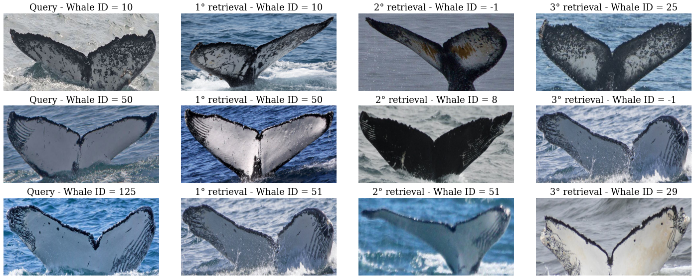

<h1 align="center">
  <br>
  Humpback whale identification
  <br>
</h1>


<p align="center">
  
</p>

<h4 align="center">A face-recognition approach to deal with <a href="https://www.kaggle.com/c/humpback-whale-identification">humpback whale re-identification</a>.</h4>

******

<p align="center">Deep Learning Project - UniCT, DMI.</p>

## Pretrained models

[will be uploaded somewhere soon]

## Installation

Download and install `Anaconda` or `miniconda` from the [official website](https://www.anaconda.com/products/distribution). Make it works by opening a shell and running:

```bash
$ conda env list
```

This should prompt the list of your conda environments. Now create a new environment: 

```bash
$ conda create -n humpback python=3.9
```

And activate the new env:

```bash
$ conda activate humpback
```

Finally, clone the repository and install the `humpback` module running the following inside the project folder:

```bash
$ pip install -e .
```

## Training

Start the training using `train.py` script: 

```bash
(humpback) <humpback-whale> python train.py --help
usage: train.py [-h] --images-dir IMAGES_DIR [--epochs EPOCHS] [--grad-acc-size GRAD_ACC_SIZE] [--grad-acc-step GRAD_ACC_STEP] [--emb-size EMB_SIZE] [--backbone BACKBONE] [--lr LR] [--wd WD]
                [--eta-min ETA_MIN]

optional arguments:
  -h, --help
  --images-dir IMAGES_DIR
  --epochs EPOCHS
  --grad-acc-size GRAD_ACC_SIZE
  --grad-acc-step GRAD_ACC_STEP
  --emb-size EMB_SIZE
  --backbone BACKBONE
  --lr LR
  --wd WD
  --eta-min ETA_MIN
```

## Authors

- [@lemuelpuglisi](https://www.github.com/lemuelpuglisi)